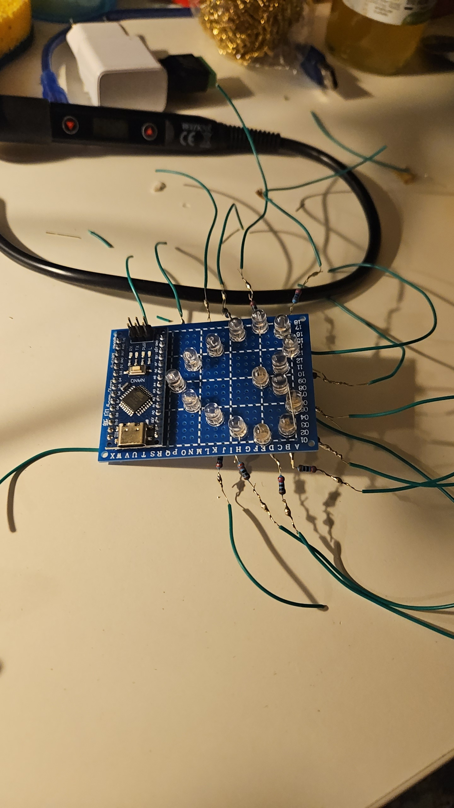
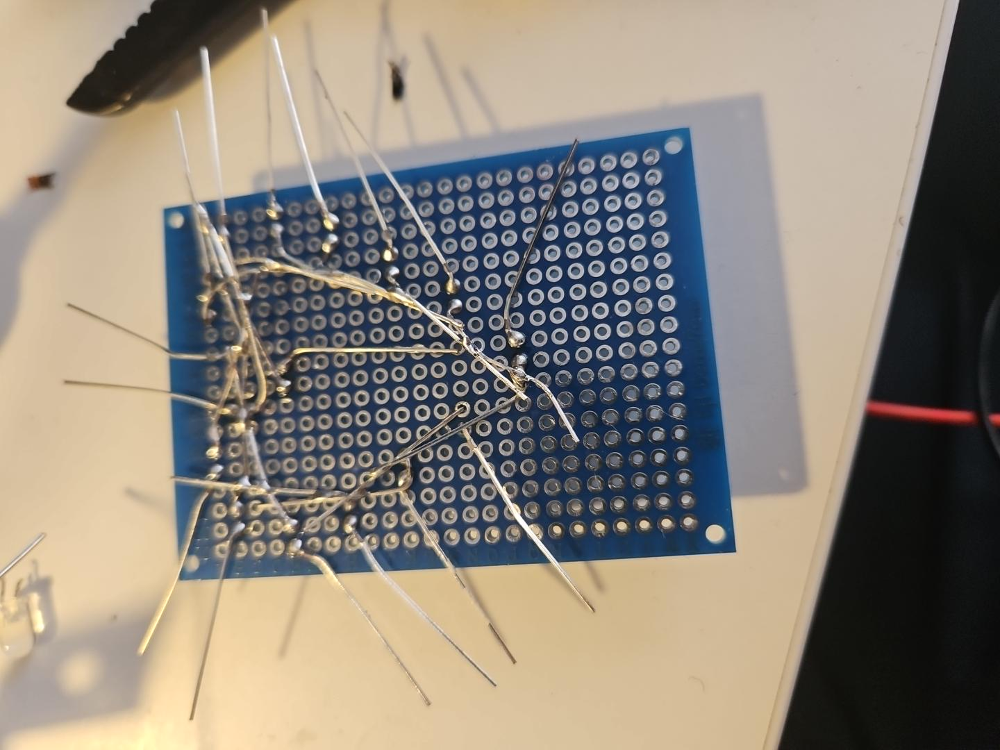
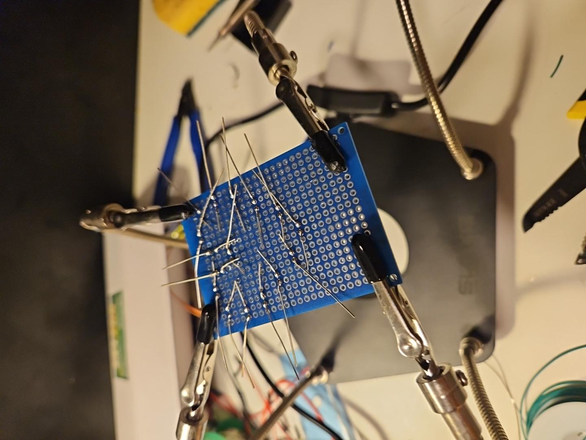
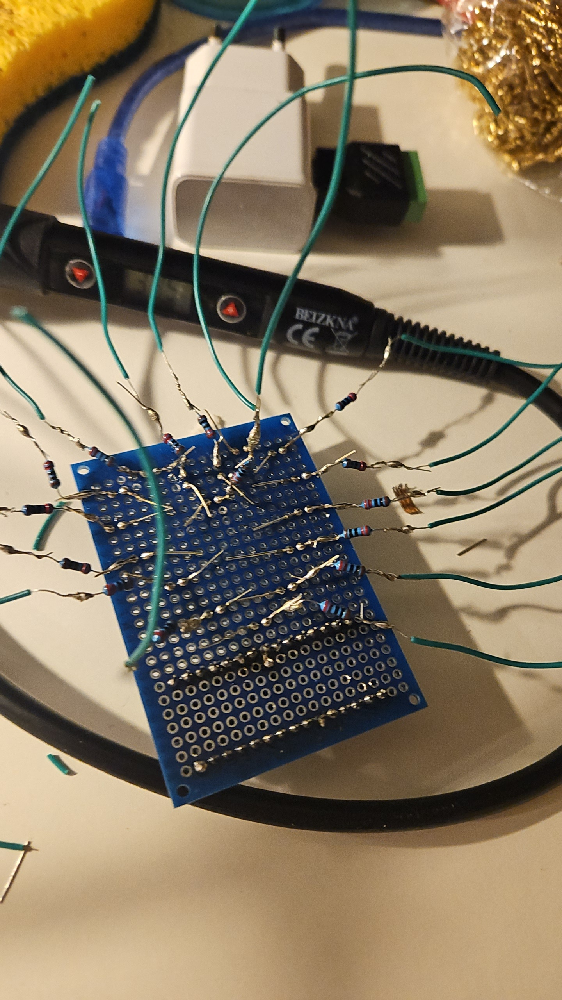

# Cœur lumineux — Arduino Nano

  

Cœur de 16 LED roses pilotées individuellement par un Arduino Nano (ATmega328P). Le montage est réalisé à la main sur plaque à pastilles, avec une résistance de 220 Ω par LED et une masse commune.

## Matériel

- Arduino Nano V3, 5 V / 16 MHz ;
- 16 LED roses de 5 mm ;
- 16 résistances de 220 Ω ;
- plaque à pastilles 50 × 70 mm ;
- bouton poussoir entre A4 et GND (`INPUT_PULLUP`) ;
- alimentation et programmation par USB.

Chaque anode est reliée à une sortie GPIO via sa propre résistance. Les cathodes partagent la même masse.

## Brochage

| LED | Broche | LED | Broche |
| ---: | :---: | ---: | :---: |
| 1 | D2 | 9 | D10 |
| 2 | D3 | 10 | D11 |
| 3 | D4 | 11 | D12 |
| 4 | D5 | 12 | D13 |
| 5 | D6 | 13 | A0 |
| 6 | D7 | 14 | A1 |
| 7 | D8 | 15 | A2 |
| 8 | D9 | 16 | A3 |

Le bouton utilise A4. A5 n’est pas câblée et sert de source pour `randomSeed()`.

## Firmware

Le sketch principal est [`src/led_heart/led_heart.ino`](src/led_heart/led_heart.ino). Écrit en C++ Arduino, il utilise un masque de 16 bits pour sélectionner les LED et un rafraîchissement par groupes de quatre.

Animations codées : remplissage progressif, double battement, chenillard, scintillement aléatoire et respiration. Un appui court lance la séquence ; un appui long active ou coupe l’animation au repos. Aucune bibliothèque externe n’est nécessaire.

## Mise au point

Les principaux défauts venaient du câblage : faux contacts, conducteurs nus qui se croisaient, pastilles abîmées au dessoudage et mauvais contacts après reprise.

Le diagnostic a été fait LED par LED avec :

- contrôle de polarité ;
- tests de continuité et recherche de courts-circuits ;
- mesures des niveaux GPIO et de l’alimentation ;
- reprise des soudures et remplacement de liaisons nues par du fil étamé ou isolé ;
- vérification du port série, du CH340 et du bootloader du Nano.

## Compiler et téléverser

Ouvrir le sketch dans l’IDE Arduino, choisir **Arduino Nano / ATmega328P**, puis sélectionner le port série. Sur certains clones, l’option **ATmega328P (Old Bootloader)** est nécessaire.

## Photos de fabrication

  
  
  

